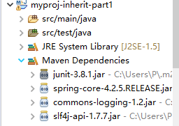
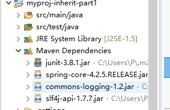

# Maven 继承、聚合、依赖(dependencyManagement部分)

## 1、项目结构


myproj-inherit/pom.xml为父pom，myproj-inherit-part1/pom.xml为子pom


## 2、主要代码及说明

父pom中，将packaging设置为pom，并在modlues中声明子模块（聚合），对于聚合而言，当我们在被聚合的项目上使用Maven命令时，实际上这些命令都会在它的子模块项目上使用

```xml
<groupId>com.oops.myproj</groupId>
	<artifactId>myproj-inherit</artifactId>
	<version>0.0.1-SNAPSHOT</version>
	<packaging>pom</packaging>
	<name>myproj-inherit</name>

	<modules>
		<!-- 这里配置的不是artifactId，而是这个模块的目录名称 -->
		<module>../myproj-inherit-part1</module>
	</modules>
```

子pom中，在parent节点中声明父pom（继承），另外可以不必再声明groupId和version通过继承父pom获得父Pom对应属性。

```xml
	<parent>
		<groupId>com.oops.myproj</groupId>
		<artifactId>myproj-inherit</artifactId>
		<version>0.0.1-SNAPSHOT</version>
		<relativePath>../myproj-inherit/pom.xml</relativePath>
	</parent>
	<artifactId>myproj-inherit-part1</artifactId>
	<packaging>jar</packaging>
	<name>myproj-inherit-part1</name>
```

父pom中dependencies节点中的所有依赖会被子项目自动全部继承。

```xml
父pom
<!-- 该节点下的依赖会被子项目自动全部继承 -->
	<dependencies>
		<dependency>
			<groupId>junit</groupId>
			<artifactId>junit</artifactId>
			<version>3.8.1</version>
			<scope>test</scope>
		</dependency>

		<dependency>
			<groupId>org.slf4j</groupId>
			<artifactId>slf4j-api</artifactId>
			<version>1.7.7</version>
			<type>jar</type>
			<scope>compile</scope>
		</dependency>
```

```xml
子pom
<dependencies>
		<dependency>
			<groupId>junit</groupId>
			<artifactId>junit</artifactId>
			<version>3.8.1</version>
			<scope>test</scope>
		</dependency>
		
		<!-- 父pom的dependencyManagement中已经指定了版本所以这里无需再声明版本号 -->
		<dependency>
			<groupId>org.springframework</groupId>
			<artifactId>spring-core</artifactId>
		</dependency>
	</dependencies>
```

子pom中并未显式声明slf4j的依赖，但因为继承了父pom，子项目也会导入slf4j的jar包。



dependencyManagement和pluginManagement作用类似可以在父pom中指定依赖、插件的版本，这样子pom中可以不用再声明版本号。如：

```xml
父pom
<dependencyManagement>
		<!-- 该节点下的依赖关系只是为了统一版本号，不会被子项目自动继承， -->
		<!--除非子项目主动引用，好处是子项目可以不用写版本号 -->
		<dependencies>
			<dependency>
				<groupId>org.springframework</groupId>
				<artifactId>spring-core</artifactId>
				<version>4.2.5.RELEASE</version>
			</dependency>
		</dependencies>
	</dependencyManagement>

	<build>
		<pluginManagement>
			<!-- 该节点作用与dependencyManagement类似 -->
		</pluginManagement>
	</build>
```

```xml
子pom
   <dependencies>
<!-- 父pom的dependencyManagement中已经指定了版本所以这里无需再声明版本号 -->
		<dependency>
			<groupId>org.springframework</groupId>
			<artifactId>spring-core</artifactId>
		</dependency>
	</dependencies>
	
	<build>
		<pluginManagement>
			<!-- 这个元素和dependencyManagement相类似，它是用来进行插件管理的-->
		</pluginManagement>
	</build>
```

如图，虽然子pom中并未显示声明spring-core的版本号，导入的是父pom dependencyManagement中定义的版本号：


