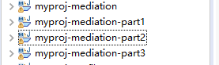
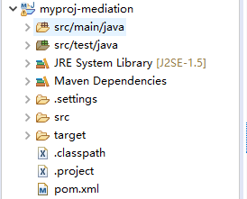
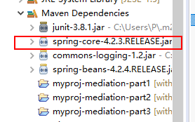
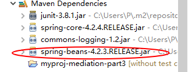

# 依赖调解

## 1、项目结构





## 2、关键代码及说明

依赖调解两个原则：1、距离最短优先 2、距离相等，先声明的优先

首先我们来看看距离相等的情况

```xml
<!-- mediation项目声明了part1和part2的依赖 -->
<dependencies>
		<dependency>
			<groupId>junit</groupId>
			<artifactId>junit</artifactId>
			<version>3.8.1</version>
			<scope>test</scope>
		</dependency>
		<dependency>
			<groupId>com.oops.myproj</groupId>
			<artifactId>myproj-mediation-part1</artifactId>
			<version>0.0.1-SNAPSHOT</version>
			<type>jar</type>
		</dependency>
		<dependency>
			<groupId>com.oops.myproj</groupId>
			<artifactId>myproj-mediation-part2</artifactId>
			<version>0.0.1-SNAPSHOT</version>
			<type>jar</type>
		</dependency>
	</dependencies>
```

在part1的pom中声明了两个名称相同，版本不同的依赖

```xml
<dependencies>
		<dependency>
			<groupId>org.springframework</groupId>
			<artifactId>spring-core</artifactId>
			<version>4.2.2.RELEASE</version>
		</dependency>
		<dependency>
			<groupId>org.springframework</groupId>
			<artifactId>spring-core</artifactId>
			<version>4.2.3.RELEASE</version>
		</dependency>
	</dependencies>
```

此时part1中引入的是4.2.3的jar包，可见在同一pom下声明版本不同依赖会按后者引入。


再看part2的pom，声明了一个4.2.4的spring-core依赖

```xml
<dependencies>
	<dependency>
		<groupId>org.springframework</groupId>
		<artifactId>spring-core</artifactId>
		<version>4.2.4.RELEASE</version>
	</dependency>
	<dependency>
		<groupId>com.oops.myproj</groupId>
		<artifactId>myproj-mediation-part3</artifactId>
		<version>0.0.1-SNAPSHOT</version>
	</dependency>
</dependencies>
```
此时，对于mediation来说，part1中的spring-core和part2中的spring-core距离是相同的，但是mediation的pom中先声明了part1所以，引入的将会是spring-core-4.2.3的包。



接下来看看距离不同的，part2声明了一个spring-beans-4.2.3的依赖，以及part3的依赖

```xml
<dependency>
			<groupId>org.springframework</groupId>
			<artifactId>spring-beans</artifactId>
			<version>4.2.4.RELEASE</version>
		</dependency>
		<dependency>
			<groupId>com.oops.myproj</groupId>
			<artifactId>myproj-mediation-part3</artifactId>
			<version>0.0.1-SNAPSHOT</version>
		</dependency>
	</dependencies>
```

而part3中又声明了一个对spring-beans-4.2.4的依赖

```xml
<dependencies>
		<dependency>
			<groupId>junit</groupId>
			<artifactId>junit</artifactId>
			<version>3.8.1</version>
			<scope>test</scope>
		</dependency>
		<dependency>
			<groupId>org.springframework</groupId>
			<artifactId>spring-beans</artifactId>
			<version>4.2.4.RELEASE</version>
		</dependency>
	</dependencies>
```

此时对于part2来说，这两个spring-beans的距离是不同的，4.2.3的距离要短，所以引入的是4.2.3的包



