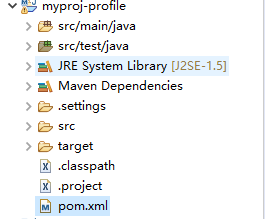
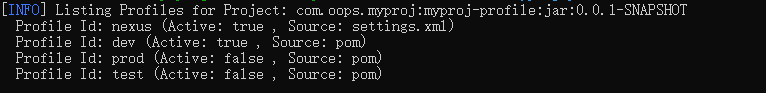
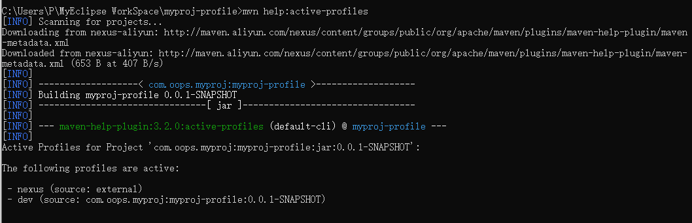
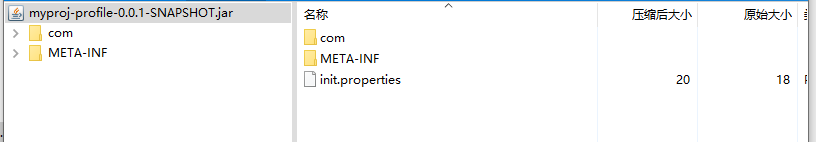
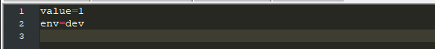
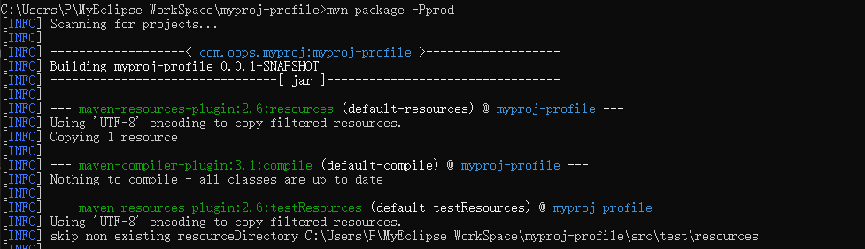
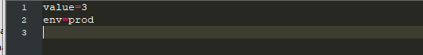

# profile示例项目

## 1、项目结构



在开发过程中，我们经常会根据不同的环境配置不同的参数，如数据源的ip，username，password、url、秘钥等都会不同，传统方式是在一个配置文件中通过修改properties文件中的参数值或者通过注释解注释来达到目的，这样不仅容易出错，还浪费不必要的时间，更重要的是把代码发布到测试环境或者生产环境还容易忘记改。为解决这种问题，maven提供了一种解决方案，就是profile。

## 2、关键代码及说明

```xml
<project xmlns="http://maven.apache.org/POM/4.0.0" xmlns:xsi="http://www.w3.org/2001/XMLSchema-instance"
  xsi:schemaLocation="http://maven.apache.org/POM/4.0.0 http://maven.apache.org/xsd/maven-4.0.0.xsd">
  <modelVersion>4.0.0</modelVersion>

  <groupId>com.oops.myproj</groupId>
  <artifactId>myproj-profile</artifactId>
  <version>0.0.1-SNAPSHOT</version>
  <packaging>jar</packaging>

  <name>myproj-profile</name>
  <url>http://maven.apache.org</url>

  <properties>
    <project.build.sourceEncoding>UTF-8</project.build.sourceEncoding>
  </properties>

  <dependencies>
    <dependency>
      <groupId>junit</groupId>
      <artifactId>junit</artifactId>
      <version>3.8.1</version>
      <scope>test</scope>
    </dependency>
  </dependencies>
  
  <profiles>
  	<profile>
  		<id>dev</id>
  		<properties>
  			<env>dev</env>
  		</properties>
  		<activation>
  		<!-- 设置默认环境 -->
  			<activeByDefault>true</activeByDefault>
  		</activation>
  	</profile>
  	<profile>
  		<id>test</id>
  		<properties>
  			<env>test</env>
  		</properties>
  	</profile> 	
  	<profile>
  		<id>prod</id>
		<properties>
			<env>prod</env>
		</properties>
  	</profile>
  </profiles>
  
  <build>
  	<filters>
  		<!-- 可以有多个filter但会以最后一个为准，一般只配置一个 -->
  		<filter>src/main/resources/${env}.properties</filter>
  	</filters>
  	<resources>
  		<resource>
  			<!-- 指定资源文件目录 -->
  			<directory>src/main/resources</directory>
  			<!-- true表示init.properties会根据${env}.properties的配置来填充，false表示上文的filters配置失效 -->
  			<filtering>true</filtering>
  			<!-- includes指定打包时需要打到jar/war包里的配置文件，如下需要把init.properties打到包里，其他不要 -->
  			<includes>
  				<include>init.properties</include>
  			</includes>
  		</resource>
  	
  	</resources>
  </build>
  
</project>

```

resources文件夹中有dev.properties、prod.properties、test.properties以及init.properties。

init.properties中

```properties
value=${value}
env=${env}
```

dev、test、prod中声明的value值分别为1、2、3

通过mvn help:all-profiles查看所有profile



此时在打包的时候不指定环境，则默认为dev环境(avtiveByDefault定义)，可以通过mvn help:active-profiles查看



也可以通过打开target目录下的jar包中的Init.properties查看





可以通过-P参数指定环境为prod



此时打包进去的init.properties的值为



