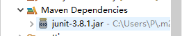
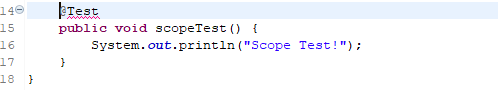

# 依赖范围

## 1、简介

Maven依赖范围的测试项目。

```xml
 <!-- scope:compile、test、provided、runtime、system、import -->
      <!-- compile对编译、测试、运行classpath均有效 -->
      <!-- test只对test classpath有效 -->
      <!-- provided对编译和测试classpath有效 -->
      <!-- runtime对测试和运行classpath有效 -->
      <!-- system与provided范围一致，但需通过systemPath显式指定依赖文件路径
             不是通过maven仓库解析的，而是与本机绑定，所以谨慎使用，可能不可重现 -->
      <!-- import导入依赖范围，不会对三种classpath产生实际影响 -->
```

## 2、关键代码及说明

如下，声明了一个scope为test的junit依赖

```xml
<dependencies>
    <dependency>
      <groupId>junit</groupId>
      <artifactId>junit</artifactId>
      <version>3.8.1</version>
      <!-- scope:compile、test、provided、runtime、system、import -->
      <!-- compile对编译、测试、运行classpath均有效 -->
      <!-- test只对test classpath有效 -->
      <!-- provided对编译和测试classpath有效 -->
      <!-- runtime对测试和运行classpath有效 -->
      <!-- system与provided范围一致，但需通过systemPath显式指定依赖文件路径
             不是通过maven仓库解析的，而是与本机绑定，所以谨慎使用，可能不可重现 -->
      <!-- import导入依赖范围，不会对三种classpath产生实际影响 -->
      <scope>test</scope>
    </dependency>
  </dependencies>
```

如图，在项目中junit的jar包是灰色的，表示只对测试有效。在主代码中使用@Test注解报错，而在测试代码中正常运行。





