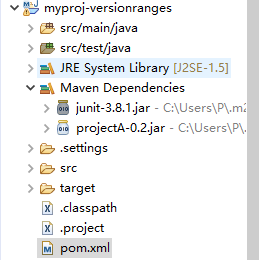

# 版本范围

## 1、项目结构



## 2、关键代码及说明

```xml
<dependencies>
    <dependency>
      <groupId>com.oops.myproj</groupId>
      <artifactId>projectA</artifactId>
      <version>(,1.0]</version>
      <scope>compile</scope>
      <type>jar</type>
    </dependency>
  </dependencies>
```

声明了一个版本范围为(,1.0]的projectA的依赖，本地仓库中有projectA-0.2版本jar包和projectA-1.1版本的jar包，此时将会引入0.2版本的jar包。


现在将版本范围改为[1.0,)，此时将会引入1.1的jar包

