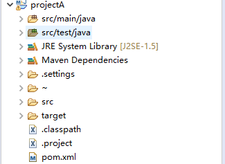
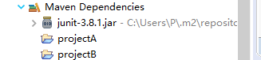

# 依赖传递、排除依赖、可选依赖示例

## 1、项目结构




## 2、关键代码及说明

projectA的pom

```xml
 <dependencies>
    <dependency>
      <groupId>junit</groupId>
      <artifactId>junit</artifactId>
      <version>3.8.1</version>
      <scope>test</scope>
    </dependency>
  </dependencies>
```

projectB的pom

```xml
<dependencies>
		<dependency>
			<groupId>com.oops.myproj</groupId>
			<artifactId>projectA</artifactId>
			<version>${version}</version>
			<scope>compile</scope>
         <!--  <optional>true</optional>-->  
		</dependency>
		<dependency>
			<groupId>junit</groupId>
			<artifactId>junit</artifactId>
			<version>3.8.1</version>
			<scope>test</scope>
		</dependency>
	</dependencies>
```

projectC的pom

```xml
<dependencies>
		<dependency>
			<groupId>com.oops.myproj</groupId>
			<artifactId>projectB</artifactId>
			<version>0.0.1-SNAPSHOT</version>
			<scope>compile</scope>
			<!--
            <exclusions>
				<exclusion>
					<groupId>com.oops.myproj</groupId>
					<artifactId>projectA</artifactId>
				</exclusion>
			</exclusions>
            -->
		</dependency>
		<dependency>
			<groupId>junit</groupId>
			<artifactId>junit</artifactId>
			<version>3.8.1</version>
			<scope>test</scope>
		</dependency>
	</dependencies>
```

因为依赖的传递，projectC中引入了如下这些包：



此时如果将projectB中的projectA声明为可选依赖

```xml
<dependency>
			<groupId>com.oops.myproj</groupId>
			<artifactId>projectA</artifactId>
			<version>${version}</version>
			<scope>compile</scope>
           <optional>true</optional>
		</dependency>
```

此时projectC中引入了如下包：


注释掉可选依赖，此时在projectC中对projectB的依赖添加对projectA的排除依赖

```xml
<dependency>
			<groupId>com.oops.myproj</groupId>
			<artifactId>projectB</artifactId>
			<version>0.0.1-SNAPSHOT</version>
			<scope>compile</scope>
			<exclusions>
				<exclusion>
					<groupId>com.oops.myproj</groupId>
					<artifactId>projectA</artifactId>
				</exclusion>
			</exclusions>
		</dependency>
```

此时projectC引入包的情况：


